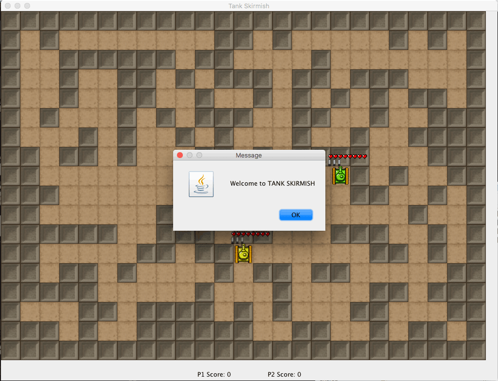
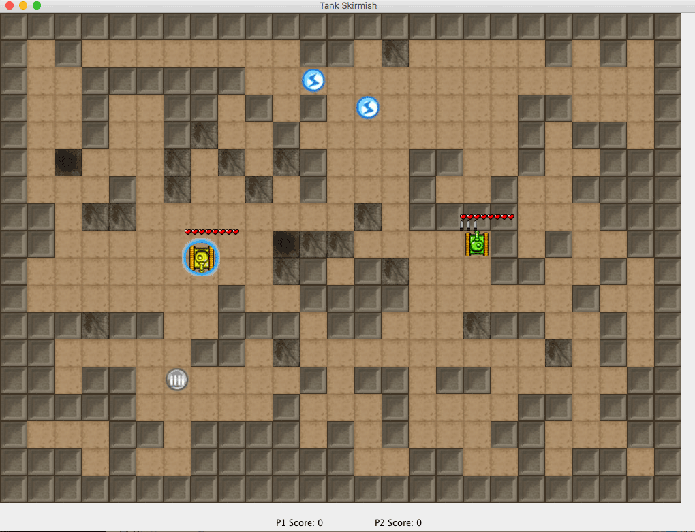
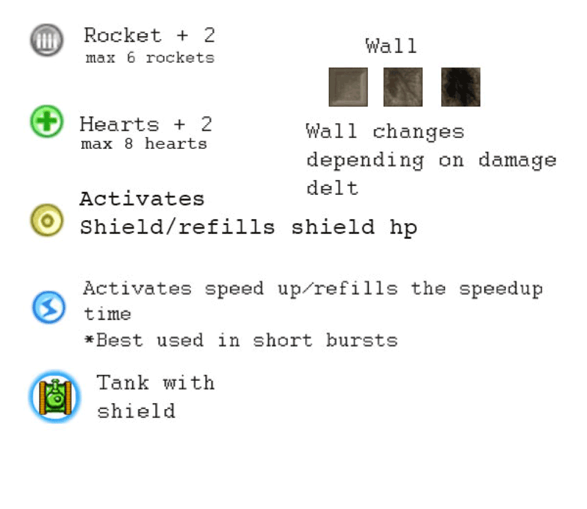

# Tank Skirmish
Tank Skirmish is a two player top-down arcade game complete with: powerups and breakable terrain which is randomized every game.

# Starting the game
Double click on the jar file and enjoy.

# Screenshots




# Items


# Open using NetBeans
Simply open the project in NetBeans and you are good to go.

# Compiling the source using Command Line
NOTE: All commands are run using the root folder (ie the one with the .git folder)

1. Create a folder called "classes"

2. Build the java files using:
``` shell
javac -d classes -cp classes .\src\javmarr\mazeGame\*.java
```
3. Copy the contents from the "res" folder to the "classes" folder

4. Run using
``` shell
java -cp classes javmarr.mazeGame.Driver
```

# Objective
Survive and kill as many opponents as possible to get the highest number of kills in a row (after being destroyed, you’ll be asked to type your name to record the number of kills on the high score chart).

# Tips:
* Use the items hidden in some bricks to find victory.
* Rockets are strong but limited; use bullets when out of rockets.
* Bullets are better for breaking walls and getting items, Rockets do more damage so save them for your opponent
* Shields protect from one rocket or 5 bullets// use it to your advantage

# Instructions
| Action | P1 | P2 |
| ------ | ------ | ------ |
| Up | w | up arrow |
| Down | s | down arrow |
| Left | a | left arrow |
| Right | d | right arrow |
| Rocket | k | 2 |
| Bullet | j | 1 |
| Respawn | r | 8 |
| Boost* | l | 3 |
-------------
*Press boost button after getting the item to toggle speed up (lasts a certain amount of time). Gather speed icons to replenish countdown.
